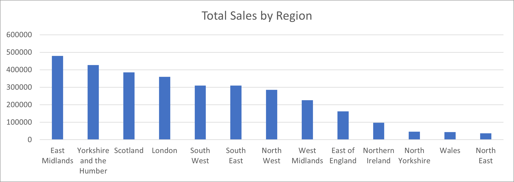
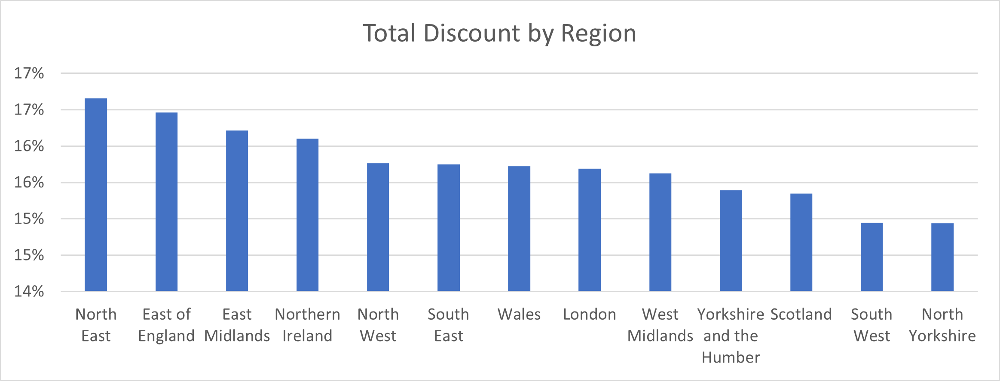
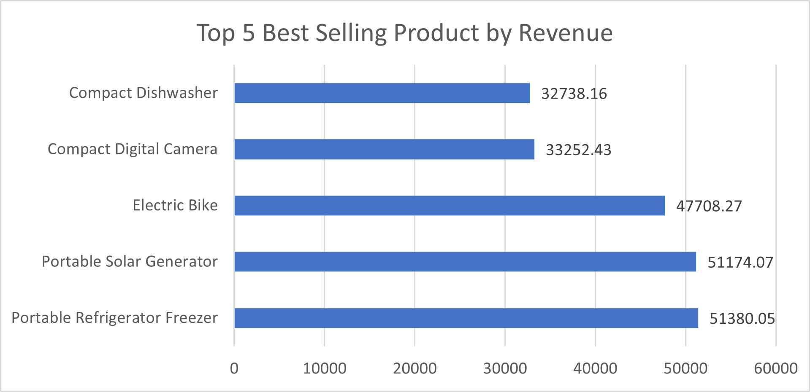
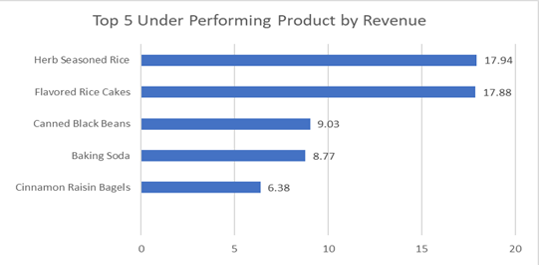
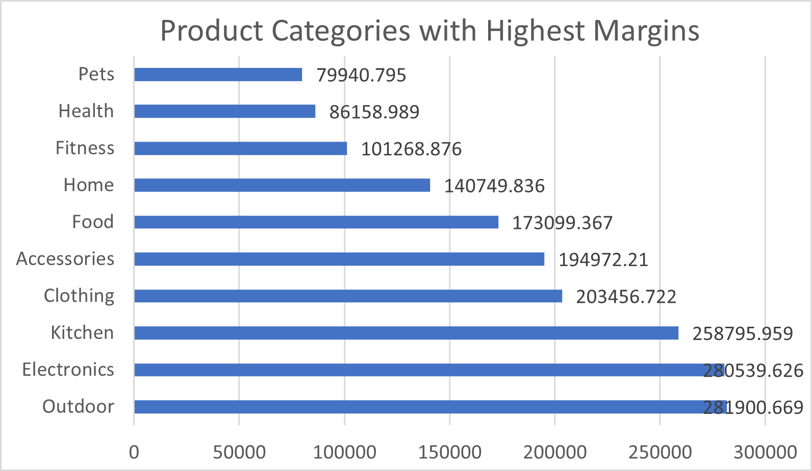
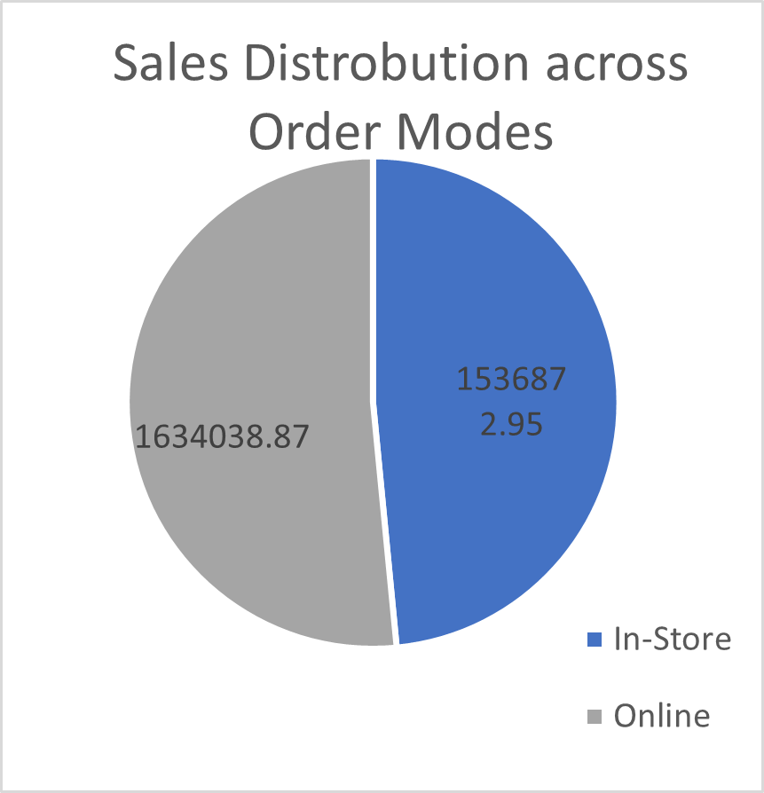

# RDAMP-Sales-Analysis
# Ace Superstore Sales Analysis – RDAMP Task 1

**Analyst**: Aqsa Shabbir
**Program**: Realcare Data Analyst Mentorship Program (RDAMP) 
**Tool Used**: Microsoft Excel (for data cleaning, transformation, analysis, and visualization)

---

## Overview

This business intelligence report explores sales performance data from Ace Superstore to answer key foundational questions related to revenue, discount patterns, regional performance, product profitability, and sales channels. The analysis supports data-driven decision-making for strategic expansion and operational optimization.

---

## 1. Data Cleaning Process

To ensure a robust and insightful analysis of the Ace Superstore Retail Dataset, we began with comprehensive data cleaning and transformation steps. These steps were necessary to address missing values, standardize inconsistent entries, and engineer features that would allow more effective business intelligence reporting. Below is a detailed account of the procedures undertaken:

### a. Column Splitting
The original dataset contained a Category column with compound values, such as 'Food - Snacks' or 'Clothing - Coats', combining broader categories and product segments. To improve granularity and support segmented analysis:
- The `Category` column was split into:
  - `Category`: Broader classification (e.g., "Food", "Clothing")
  - `Segment`: Specific product type (e.g., "Snacks", "Coats")

### b. Handling Missing Location Data
- `Region` and `Country`: Filled using mapped values from the `City` column using Store Locations(Store Locations).

### c. Imputing Missing Discounts
- `Discount`: Null values replaced with `0` (assuming no discount was applied).

### d. Category Standardization
- Many product types were redundantly classified under varied subcategories within the same theme:
- All variations such as Clothing - Bags, Clothing - Coats, etc., were unified under the single category **Clothing**.
- A similar standardization was applied for the Food category and other domains.
- For example, "Bathroom" was merged under the broader **Home** category, combining them for a more insightful and compact analysis of product performance.

### e. Feature Engineering
To enrich the dataset for margin and profitability analysis, we engineered new columns:
- Total Sales: Computed as Sales × Quantity, giving the total revenue from a transaction line.
- Margin: Calculated as Sales − Cost Price, representing per-unit profitability.
- Total Margin: Calculated as Margin × Quantity, representing the overall profit for each transaction line.
- These new columns enable further insights into revenue drivers and profit contributors by product, region, and order channel.

These steps ensured consistency and enabled profit and trend analysis.

---

## 2. Insights and Analysis

### 2.1 Regional Performance – Sales & Discounts

  

- Top-performing regions by total sales include:
  - East Midlands, Scotland, Yorkshire and the Humber, and London, each recording over £350,000 in total sales.
  - Lowest performing regions include North East, North Yorkshire, and Wales, all of which contribute minimal sales and may benefit from marketing attention or distribution expansion.
- In terms of average discount rates, the highest were observed in:
  - North East (above 17%), followed by East of England and Northern Ireland.
- Interestingly, East Midlands—the highest sales contributor—had a moderate discount rate (~16.5%), indicating that strong sales are not purely discount-driven.
- Wales and North Yorkshire show both low sales and low discount rates, making them prime candidates for demand-stimulation strategies (e.g., promotions or pricing revision).

### 2.2 Best-Selling & Underperforming Products

#### Top 5 Best-Selling Products
  

| Product                     | Revenue (£) |
|----------------------------|-------------|
| Portable Refrigerator Freezer | 51,380.05 |
| Portable Solar Generator       | 51,174.07 |
| Electric Bike                  | 47,708.27 |
| Compact Digital Camera         | 33,252.43 |
| Compact Dishwasher             | 32,738.16 |

#### Top 5 Underperforming Products
  
| Product                  | Revenue (£) |
|--------------------------|-------------|
| Herb Seasoned Rice       | 17.94       |
| Flavored Rice Cakes      | 17.88       |
| Canned Black Beans       | 9.03        |
| Baking Soda              | 8.77        |
| Cinnamon Raisin Bagels  | 6.38        |

> These products are all low-cost food items, and their total revenue contribution is negligible.
> While likely to have high unit turnover, their low price points and low margin potential make them less profitable and possibly non-strategic for growth.
> These results highlight an opportunity to:
  - Reassess inventory strategies for these items
  - Explore bundling or up-selling with other categories
---

### 2.3 Product Categories with Highest Margins

| Category     | Total Margin (£) |
|--------------|------------------|
| Outdoor      | 281,900.67       |
| Electronics  | 280,539.63       |
| Kitchen      | 258,795.96       |

- These three significantly outpace others and should be considered core strategic product categories.
- Clothing and Accessories also exhibit strong margins (over £190K), signaling stable profitability despite potentially lower volume.
- On the other end, Pets, Health, and Fitness yielded the lowest total margins, indicating either low markup or low sales volume.
---

### 2.4 Online vs In-Store Sales

- **Online Sales**: £1.63M (91.4%)  
- **In-Store Sales**: £153K (8.6%)

- This strongly indicates a digital-first consumer base, making e-commerce optimizations, logistics, and online promotions high-priority areas for the business.
- The low In-Store revenue may suggest:
  - Fewer retail outlets
  - Limited in-store promotions
  - Or changing consumer behavior post-pandemic
  - A recommendation is to either boost In-Store engagement or double down on digital infrastructure, depending on business strategy.
---

## 3. Conclusion & Recommendations

### Key Takeaways:
The data shows a healthy revenue stream driven primarily by online sales and high-ticket items in categories such as Outdoor, Electronics, and Kitchen. However, there is significant variance in regional performance and an overrepresentation of low-revenue grocery items, which may dilute profitability.

### Recommendations:
1. **Scale high-margin categories**: Focus on Outdoor, Electronics, Kitchen.
2. **Reassess low-performing regions**: e.g., North East, Wales.
3. **Optimize product inventory**: Phase out or bundle low-profit food items.
4. **Double down on digital**: Invest in e-commerce experience and operations.
5. **Expand analysis scope**: Consider segment-based profitability tracking and forecasting.

---

## Repository Contents

- `Aqsa_Shabbir_Sales_Report.xlsx`: Cleaned dataset with visualization dashboard
- `README.md`: This report in Markdown format

---

